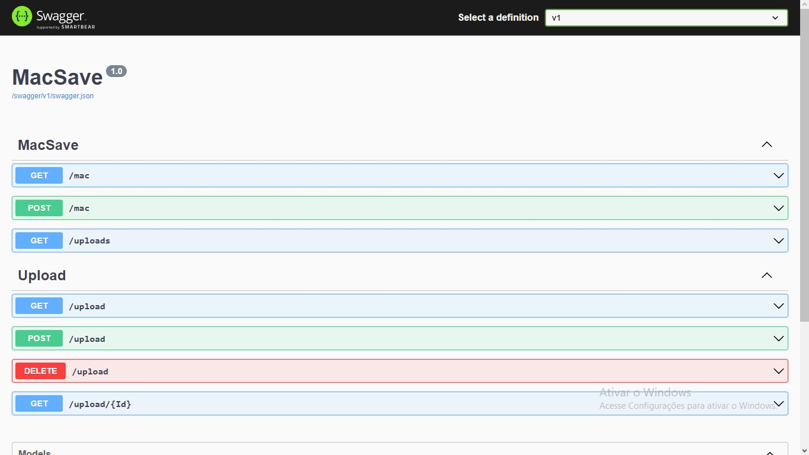

# mac_register


[English](#english-documentation) | [Português](#documentação-em-português)

---

## English Documentation
### API Documentation



#### Retrieve All Items

```http
  GET http://localhost:{port}/mac
```

Returns all items in JSON format as shown below.

```json
{
  "id": 0,
  "model": "string",
  "mac": "string",
  "data": "string"
}
```

---

#### Create a New Item

```http
  POST http://localhost:{port}/mac
```

Allows the creation of a new Mac item with the fields below.
   Note that **id** is an auto-incremental parameter. 

```json
{
  "id": 0,
  "model": "string",
  "mac": "string",
  "data": "string"
}
```

---

#### Retrieve All Items

```http
  GET http://localhost:{port}/upload
```

Returns all items in JSON format as shown below.

```json
{
  "id": "integer ($int32)",
  "model": "string",
  "mac": "string",
  "problem": "boolean",
  "remoteAccess": "boolean"
}
```

---

#### Retrieve Item by ID

```http
  GET http://localhost:{port}/upload/ID
```

Returns the first corresponding item in JSON format as shown below.

```json
{
  "id": "integer ($int32)",
  "model": "string",
  "mac": "string",
  "problem": "boolean",
  "remoteAccess": "boolean"
}
```

| Parameter   | Type       | Description                                   |
| :---------- | :--------- | :------------------------------------------ |
| `ID`        | `Int`      | **Required**. ID of the item to be retrieved |

---

#### CSV File Upload

```http
  POST http://localhost:{port}/upload
```

Allows the upload of a **.CSV** file using FormData. Check the example file model.  
**Path:**
 _./Example /Example.csv_
    
```json
{
  "File": "FileName",
  "FilePath": "$FilePath",
}
```

| Parameter   | Type       | Description                                   |
| :---------- | :--------- | :------------------------------------------ |
| `File`      | `FileName` | **Required**. File name |
| `FilePath`  | `FilePath` | **Required**. Full file path |

---

#### Delete an Item

```http
  DELETE http://localhost:{port}/upload/ID
```

Deletes the first item with the corresponding ID in the request.
    
| Parameter   | Type       | Description                                   |
| :---------- | :--------- | :------------------------------------------ |
| `ID`        | `Int`      | **Required**. ID of the item to be deleted |

Returns a status code (200) with the ID of the deleted item.

---

## Documentação em Português
### Documentação da API


#### Recuperar Todos os Itens

```http
  GET http://localhost:{port}/mac
```

Retorna todos os itens em formato JSON como mostrado abaixo.

```json
{
  "id": 0,
  "model": "string",
  "mac": "string",
  "data": "string"
}
```

---

#### Criar um Novo Item

```http
  POST http://localhost:{port}/mac
```

Permite a criação de um novo item Mac com os campos abaixo.
   Observe que **id** é um parâmetro autoincremental. 

```json
{
  "id": 0,
  "model": "string",
  "mac": "string",
  "data": "string"
}
```

---

#### Recuperar Todos os Itens

```http
  GET http://localhost:{port}/upload
```

Retorna todos os itens em formato JSON como mostrado abaixo.

```json
{
  "id": "integer ($int32)",
  "model": "string",
  "mac": "string",
  "problem": "boolean",
  "remoteAccess": "boolean"
}
```

---

#### Recuperar Item por ID

```http
  GET http://localhost:{port}/upload/ID
```

Retorna o primeiro item correspondente em formato JSON como mostrado abaixo.

```json
{
  "id": "integer ($int32)",
  "model": "string",
  "mac": "string",
  "problem": "boolean",
  "remoteAccess": "boolean"
}
```

| Parâmetro   | Tipo       | Descrição                                   |
| :---------- | :--------- | :------------------------------------------ |
| `ID`        | `Int`      | **Obrigatório**. ID do item a ser buscado |

---

#### Upload de Arquivo CSV

```http
  POST http://localhost:{port}/upload
```

Permite

 o envio de um arquivo **.CSV**, usando FormData. Verifique o modelo de exemplo do arquivo **CSV**.  
**Caminho:**
 _./Example /Example.csv_
    
```json
{
  "File": "NomeDoArquivo",
  "FilePath": "$CaminhoDoArquivo",
}
```

| Parâmetro   | Tipo       | Descrição                                   |
| :---------- | :--------- | :------------------------------------------ |
| `File`      | `NomeDoArquivo` | **Obrigatório**. Nome do arquivo |
| `FilePath`  | `CaminhoDoArquivo` | **Obrigatório**. Caminho completo do arquivo |

---

#### Excluir um Item

```http
  DELETE http://localhost:{port}/upload/ID
```

Exclui o primeiro item com o ID correspondente na solicitação.

| Parâmetro   | Tipo       | Descrição                                   |
| :---------- | :--------- | :------------------------------------------ |
| `ID`        | `Int`      | **Obrigatório**. ID do item a ser excluído |

Retorna um código de status (200) com o ID do item excluído.
